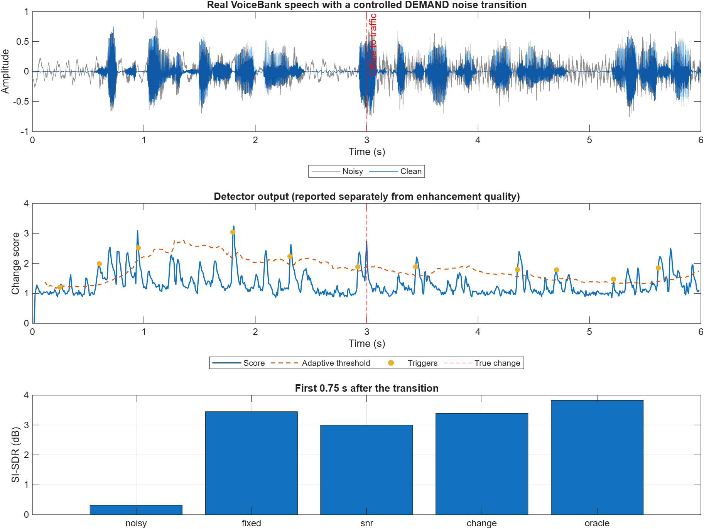

# How Quickly Should a Speech Enhancer Adapt?

## Modulation-Aware Speech Enhancement in Dynamic Acoustic Scenes

**ELEC5305 Audio and Acoustic Signal Processing Project**

**Student:** Liya Xu | **SID:** 530519058 | **GitHub:** [Liyaxuxu](https://github.com/Liyaxuxu)

## Project focus

This project studies the transient behaviour of a causal STFT speech enhancer when the acoustic environment changes abruptly. The main question is:

> Can a lightweight modulation/change-aware controller reduce adaptation delay and speech distortion compared with fixed and SNR-only Wiener baselines?

A second question is whether whole-utterance metrics hide short but important failures immediately after a scene change. The system is deliberately based on interpretable DSP so that its noise estimate, change score, Wiener gain, smoothing state, and adaptation rate can be inspected directly.

## Current progress

| Component | Status | Current evidence |
|---|---|---|
| Topic and research question | Complete | Scope revised around adaptation speed in controlled dynamic scenes. |
| Literature review | Complete for Feedback Two | Classical enhancement, modulation processing, streaming latency, neural reference, and recent adaptation work are synthesised in [`literature_review.md`](literature_review.md). |
| Dataset collection | Complete for preliminary testing | Official VoiceBank clean test speech and DEMAND OOFFICE/STRAFFIC recordings; provenance and split are documented in [`data/`](data/). |
| Controlled SNR mixer | Complete | Unit test verifies requested global SNR. |
| Dynamic scene generator | Complete | Creates a known noise A to noise B transition with pre/post SNR metadata. |
| Fixed spectral subtraction | Complete | Retained as a basic ELEC5305 baseline. |
| Fixed Wiener enhancer | Complete | Uses one common STFT/Wiener pipeline. |
| SNR-adaptive Wiener controller | Preliminary | Changes PSD-update and gain-smoothing rates using estimated frame SNR. |
| Change-aware Wiener controller | Preliminary | Uses a log-spectral change score, adaptive threshold, and hold time. |
| Oracle change-triggered Wiener | Complete | Uses the known simulated transition time as a diagnostic upper bound. |
| Automated tests | Complete | Mixing, output validity, scene metadata, and all controller modes pass. |
| Real VoiceBank/DEMAND evaluation | Preliminary | Level, noise-type, and noise-onset transitions are implemented; final held-out evaluation is not yet complete. |
| Modulation/change cue | Preliminary | The current cue measures short-time log-spectral change; a separate modulation-energy ablation remains planned. |

## Weeks 1--9 checkpoint

| Weeks | Required activity | Evidence in this repository |
|---|---|---|
| 1--2 | Consider project topic | Revised title, focused research question, four-system comparison, and oracle diagnostic. |
| 3--5 | Literature review and dataset collection | [`literature_review.md`](literature_review.md), [`references.bib`](references.bib), dataset provenance, checksums, and [`data/experiment_manifest.csv`](data/experiment_manifest.csv). |
| 6--9 | Initial implementation and testing | Causal STFT/Wiener implementation, controlled transition generator, three real-data conditions, automated tests, CSV results, plots, and listening examples. |

This checkpoint means the scheduled work has been attempted and documented. It does not mean that the final held-out experiment or controller tuning is complete.

## Experimental structure

```text
Clean speech + noise A + noise B + known transition time
                         |
                         v
               Controlled dynamic mixture
                         |
                         v
                   Causal STFT
                         |
            +------------+-------------+
            |            |             |
         Fixed       SNR-only      Change/oracle
       controller    controller      controller
            |            |             |
            +------------+-------------+
                         |
                   Wiener gain
                         |
                         v
                      ISTFT
                         |
                         v
     Global metrics + transition-region diagnostics
```

All four main systems use the same Wiener enhancement equation. Only the controller changes. This makes it possible to separate the effect of change detection from the effect of faster noise tracking and weaker gain smoothing.

## Preliminary real-data results

The first real-data run uses six seconds of clean VoiceBank speech (`p232_003.wav`) and channel 1 from the DEMAND OOFFICE and STRAFFIC recordings. A known change is introduced at 3.0 seconds. The three development conditions are a 10 dB to 0 dB level change, an office-to-traffic noise-type change at 0 dB, and a traffic-noise onset at 0 dB.



| Condition | System | Whole SI-SDR (dB) | First 0.75 s SI-SDR (dB) |
|---|---|---:|---:|
| Level change | Fixed | 3.10 | 0.59 |
| Level change | Change-aware | **5.50** | **1.40** |
| Level change | Oracle | 4.93 | 2.19 |
| Noise-type change | Fixed | **4.26** | **3.45** |
| Noise-type change | Change-aware | 4.21 | 3.39 |
| Noise-type change | Oracle | 4.94 | 3.82 |
| Noise onset | Fixed | 1.89 | **0.56** |
| Noise onset | Change-aware | **2.67** | 0.50 |
| Noise onset | Oracle | 1.81 | 0.44 |

The preliminary controller helped most for the noise-level change. For the office-to-traffic transition it was approximately equal to the fixed baseline, and at noise onset its global advantage did not carry into the first 0.75 seconds. The detector latency was 0.288 s, 0.440 s, and 1.352 s for the three conditions, with six pre-transition false alarms in each case. This means the present detector is too sensitive and too slow for onset detection.

These are development results from one utterance, not final claims. The oracle result also shows that a correct trigger does not guarantee an improvement: the fast-update rule itself must be tuned without increasing speech leakage into the noise estimate. Full-utterance and transition metrics, detector results, settling-time values, and runtime are available in [`results/real_data_metrics.csv`](results/real_data_metrics.csv) and [`results/real_data_detection_summary.csv`](results/real_data_detection_summary.csv).

The earlier synthetic experiment remains available as a pipeline smoke test in [`results/preliminary_metrics.csv`](results/preliminary_metrics.csv). It is not used as the main evidence.

## Compared systems

1. **Fixed Wiener:** fixed noise-tracking and gain-smoothing parameters.
2. **SNR-adaptive Wiener:** adaptation controlled only by estimated frame SNR.
3. **Change-aware Wiener:** adaptation triggered by a spectral/modulation change score.
4. **Oracle Wiener:** adaptation triggered by the known simulated change time.
5. **Fixed spectral subtraction:** retained as a basic baseline, not the main research system.

## Real-data protocol

Clean VoiceBank speech is mixed with selected DEMAND noises to create controlled scene changes. The current checkpoint implements:

- a noise-level change;
- a noise-type change at the same nominal SNR;
- a noise-onset condition.

Noise disappearance and matched changes during speech pauses remain final-project extensions. Development uses speaker `p232`; speaker `p257`, non-overlapping noise excerpts, and held-out transition pairs are reserved for final evaluation. The exact preliminary inputs are listed in [`data/experiment_manifest.csv`](data/experiment_manifest.csv).

The planned metrics are detection latency, false-alarm rate, transition settling time, transition-region SI-SDR or segmental SNR, STOI, residual-noise suppression, speech distortion, and processing time.

## Reproduce the experiments

### Requirements

- MATLAB R2026a or a compatible release
- Signal Processing Toolbox

After downloading the official data described in [`data/README.md`](data/README.md), run the real-data experiment from the repository root:

```matlab
addpath('src');
run('src/run_real_data_experiment.m');
```

The dataset-independent smoke test is:

```matlab
addpath('src');
run('src/run_transition_demo.m');
```

Run the automated checks with:

```matlab
addpath('src');
run('tests/run_tests.m');
```

## Repository structure

```text
.
|-- src/
|   |-- generate_dynamic_scene.m   Known-time noise transition generator
|   |-- transition_wiener.m        Four Wiener controller modes
|   |-- run_transition_demo.m      Reproducible preliminary experiment
|   |-- run_real_data_experiment.m VoiceBank + DEMAND transition experiment
|   |-- spectral_subtraction.m     Basic fixed baseline
|   `-- add_noise_at_snr.m         Controlled stationary mixture helper
|-- tests/run_tests.m              Automated MATLAB checks
|-- results/                        Figures, metrics, and audio examples
|-- docs/index.md                   GitHub Pages progress report
|-- data/                           Dataset provenance and experiment manifest
|-- literature_review.md            Focused literature review
|-- proposal.pdf                    Submitted proposal
`-- references.bib                  Project bibliography
```

## Next milestones

1. Validate the fixed Wiener implementation on real speech and stationary noise.
2. Add level, type, onset, and offset transitions using VoiceBank and DEMAND.
3. Evaluate spectral flux and short-time modulation energy as separate detectors.
4. Separate detector accuracy from controller benefit using the oracle system.
5. Tune only on development transitions, then freeze parameters for held-out testing.
6. Add a pretrained DeepFilterNet3 comparison only if the core DSP study is complete.

## Selected references

1. S. F. Boll, "Suppression of Acoustic Noise in Speech Using Spectral Subtraction," *IEEE Transactions on Acoustics, Speech, and Signal Processing*, 1979. [doi:10.1109/TASSP.1979.1163209](https://doi.org/10.1109/TASSP.1979.1163209)
2. P. Scalart and J. V. Filho, "Speech Enhancement Based on a Priori Signal to Noise Estimation," *ICASSP*, 1996. [doi:10.1109/ICASSP.1996.543199](https://doi.org/10.1109/ICASSP.1996.543199)
3. P. C. Loizou and G. Kim, "Reasons Why Current Speech-Enhancement Algorithms Do Not Improve Speech Intelligibility and Suggested Solutions," *IEEE Transactions on Audio, Speech, and Language Processing*, 2011. [doi:10.1109/TASL.2010.2045180](https://doi.org/10.1109/TASL.2010.2045180)
4. K. K. Paliwal, B. Schwerin, and K. Wojcicki, "Modulation Domain Spectral Subtraction for Speech Enhancement," *Interspeech*, 2009. [doi:10.21437/Interspeech.2009-413](https://doi.org/10.21437/Interspeech.2009-413)
5. C. Valentini-Botinhao, "Noisy Speech Database for Training Speech Enhancement Algorithms and TTS Models," University of Edinburgh DataShare, 2017. [Dataset](https://doi.org/10.7488/ds/2117)
6. C. H. Taal et al., "An Algorithm for Intelligibility Prediction of Time-Frequency Weighted Noisy Speech," *IEEE Transactions on Audio, Speech, and Language Processing*, 2011. [doi:10.1109/TASL.2011.2114881](https://doi.org/10.1109/TASL.2011.2114881)

## Academic integrity and licence

Published methods and datasets are cited in the proposal and bibliography. Third-party dataset files are not committed. The implementation in this repository is distinguished from external reference implementations.

Copyright (c) 2026 **Liya Xu**. Repository code is released under the [MIT License](LICENSE).
