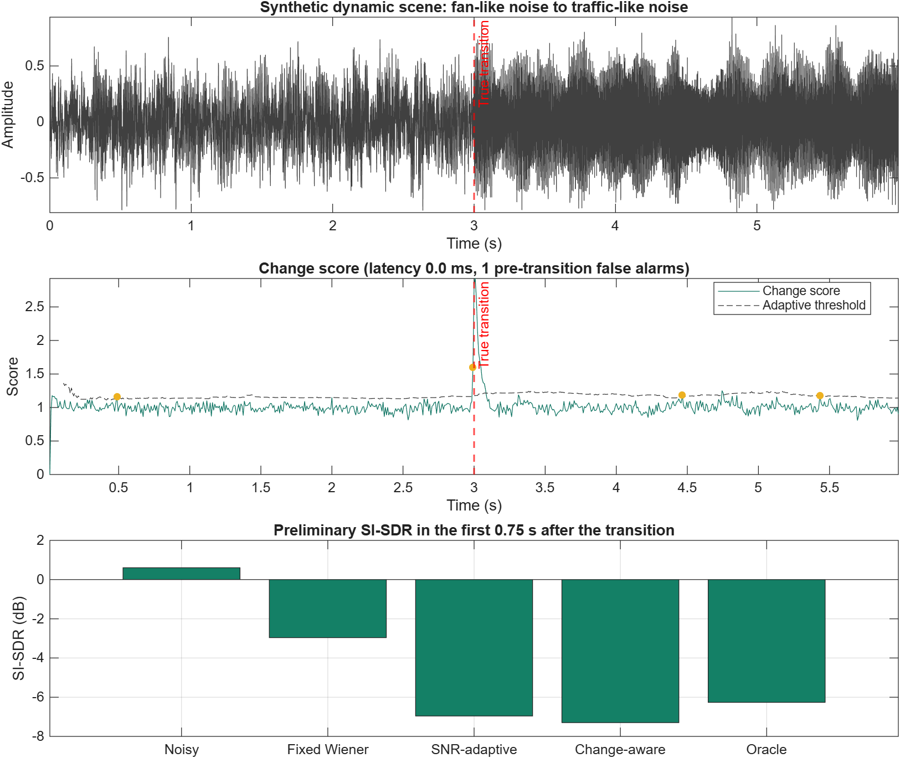

# How Quickly Should a Speech Enhancer Adapt?

## Modulation-Aware Speech Enhancement in Dynamic Acoustic Scenes

**ELEC5305 Audio and Acoustic Signal Processing Project**

**Student:** Liya Xu | **SID:** 530519058 | **GitHub:** [Liyaxuxu](https://github.com/Liyaxuxu)

## Project focus

This project studies the transient behaviour of a causal STFT speech enhancer when the acoustic environment changes abruptly. The main question is:

> Can a lightweight modulation/change-aware controller reduce adaptation delay and speech distortion compared with fixed and SNR-only Wiener baselines?

A second question is whether whole-utterance metrics hide short but important failures immediately after a scene change. The system is deliberately based on interpretable DSP so that its noise estimate, change score, Wiener gain, smoothing state, and adaptation rate can be inspected directly.

## Current progress

| Component | Status | Current evidence |
|---|---|---|
| Controlled SNR mixer | Complete | Unit test verifies requested global SNR. |
| Dynamic scene generator | Complete | Creates a known noise A to noise B transition with pre/post SNR metadata. |
| Fixed spectral subtraction | Complete | Retained as a basic ELEC5305 baseline. |
| Fixed Wiener enhancer | Complete | Uses one common STFT/Wiener pipeline. |
| SNR-adaptive Wiener controller | Preliminary | Changes PSD-update and gain-smoothing rates using estimated frame SNR. |
| Change-aware Wiener controller | Preliminary | Uses a log-spectral change score, adaptive threshold, and hold time. |
| Oracle change-triggered Wiener | Complete | Uses the known simulated transition time as a diagnostic upper bound. |
| Automated tests | Complete | Mixing, output validity, scene metadata, and all controller modes pass. |
| Real VoiceBank/DEMAND evaluation | Next | Dataset experiment and held-out transitions are not yet complete. |
| Modulation-energy cue | Next | The current detector is a spectral-change prototype. |

## Experimental structure

```text
Clean speech + noise A + noise B + known transition time
                         |
                         v
               Controlled dynamic mixture
                         |
                         v
                   Causal STFT
                         |
            +------------+-------------+
            |            |             |
         Fixed       SNR-only      Change/oracle
       controller    controller      controller
            |            |             |
            +------------+-------------+
                         |
                   Wiener gain
                         |
                         v
                      ISTFT
                         |
                         v
     Global metrics + transition-region diagnostics
```

All four main systems use the same Wiener enhancement equation. Only the controller changes. This makes it possible to separate the effect of change detection from the effect of faster noise tracking and weaker gain smoothing.

## Preliminary result

The current reproducible demo uses a six-second synthetic speech-like signal. Fan-like noise changes abruptly to traffic-like noise at 3.0 seconds while the source is active. Both sides are mixed at approximately 0 dB SNR.



| System | Whole-signal SNR (dB) | Transition SI-SDR (dB) |
|---|---:|---:|
| Noisy | 0.00 | 0.61 |
| Fixed Wiener | 1.95 | -2.96 |
| SNR-adaptive Wiener | 1.08 | -6.96 |
| Change-aware Wiener | 1.82 | -7.30 |
| Oracle Wiener | 1.79 | -6.26 |

The change score identified the true transition within one STFT-frame tolerance, but produced one earlier false alarm. The fixed Wiener baseline improved the ordinary whole-signal SNR, while all current adaptive settings produced worse SI-SDR in the first 0.75 seconds after the transition.

These are diagnostic results, not final performance claims. They show that the current fast-update state is too aggressive and can damage speech even when the transition time is known. They also show why transition-region distortion and false alarms must be measured separately from whole-utterance SNR. The next controller revision will reduce speech leakage into the noise estimate and test spectral flux and modulation energy independently.

Machine-readable results are available in:

- [`results/preliminary_metrics.csv`](results/preliminary_metrics.csv)
- [`results/change_detection_summary.csv`](results/change_detection_summary.csv)
- [`results/audio/`](results/audio/) for selected listening examples

## Compared systems

1. **Fixed Wiener:** fixed noise-tracking and gain-smoothing parameters.
2. **SNR-adaptive Wiener:** adaptation controlled only by estimated frame SNR.
3. **Change-aware Wiener:** adaptation triggered by a spectral/modulation change score.
4. **Oracle Wiener:** adaptation triggered by the known simulated change time.
5. **Fixed spectral subtraction:** retained as a basic baseline, not the main research system.

## Planned real-data experiment

Clean VoiceBank speech will be mixed with selected DEMAND noises to create controlled scene changes:

- noise-level changes;
- noise-type changes at similar overall power;
- noise onset and disappearance;
- changes during active speech and during pauses.

Development data will be used to select detector thresholds and controller rates. Final evaluation will use held-out speakers, noise excerpts, and transition pairs.

The planned metrics are detection latency, false-alarm rate, transition settling time, transition-region SI-SDR or segmental SNR, STOI, residual-noise suppression, speech distortion, and processing time.

## Reproduce the preliminary demo

### Requirements

- MATLAB R2026a or a compatible release
- Signal Processing Toolbox

From the repository root:

```matlab
addpath('src');
run('src/run_transition_demo.m');
```

Run the automated checks with:

```matlab
addpath('src');
run('tests/run_tests.m');
```

## Repository structure

```text
.
|-- src/
|   |-- generate_dynamic_scene.m   Known-time noise transition generator
|   |-- transition_wiener.m        Four Wiener controller modes
|   |-- run_transition_demo.m      Reproducible preliminary experiment
|   |-- spectral_subtraction.m     Basic fixed baseline
|   `-- add_noise_at_snr.m         Controlled stationary mixture helper
|-- tests/run_tests.m              Automated MATLAB checks
|-- results/                        Figures, metrics, and audio examples
|-- docs/index.md                   GitHub Pages progress report
|-- data/README.md                  Dataset instructions
|-- proposal.pdf                    Submitted proposal
`-- references.bib                  Project bibliography
```

## Next milestones

1. Validate the fixed Wiener implementation on real speech and stationary noise.
2. Add level, type, onset, and offset transitions using VoiceBank and DEMAND.
3. Evaluate spectral flux and short-time modulation energy as separate detectors.
4. Separate detector accuracy from controller benefit using the oracle system.
5. Tune only on development transitions, then freeze parameters for held-out testing.
6. Add a pretrained DeepFilterNet3 comparison only if the core DSP study is complete.

## Selected references

1. S. F. Boll, "Suppression of Acoustic Noise in Speech Using Spectral Subtraction," *IEEE Transactions on Acoustics, Speech, and Signal Processing*, 1979. [doi:10.1109/TASSP.1979.1163209](https://doi.org/10.1109/TASSP.1979.1163209)
2. P. Scalart and J. V. Filho, "Speech Enhancement Based on a Priori Signal to Noise Estimation," *ICASSP*, 1996. [doi:10.1109/ICASSP.1996.543199](https://doi.org/10.1109/ICASSP.1996.543199)
3. P. C. Loizou and G. Kim, "Reasons Why Current Speech-Enhancement Algorithms Do Not Improve Speech Intelligibility and Suggested Solutions," *IEEE Transactions on Audio, Speech, and Language Processing*, 2011. [doi:10.1109/TASL.2010.2045180](https://doi.org/10.1109/TASL.2010.2045180)
4. K. K. Paliwal, B. Schwerin, and K. Wojcicki, "Modulation Domain Spectral Subtraction for Speech Enhancement," *Interspeech*, 2009. [doi:10.21437/Interspeech.2009-413](https://doi.org/10.21437/Interspeech.2009-413)
5. C. Valentini-Botinhao, "Noisy Speech Database for Training Speech Enhancement Algorithms and TTS Models," University of Edinburgh DataShare, 2017. [Dataset](https://doi.org/10.7488/ds/2117)
6. C. H. Taal et al., "An Algorithm for Intelligibility Prediction of Time-Frequency Weighted Noisy Speech," *IEEE Transactions on Audio, Speech, and Language Processing*, 2011. [doi:10.1109/TASL.2011.2114881](https://doi.org/10.1109/TASL.2011.2114881)

## Academic integrity and licence

Published methods and datasets are cited in the proposal and bibliography. Third-party dataset files are not committed. The implementation in this repository is distinguished from external reference implementations.

Copyright (c) 2026 **Liya Xu**. Repository code is released under the [MIT License](LICENSE).
