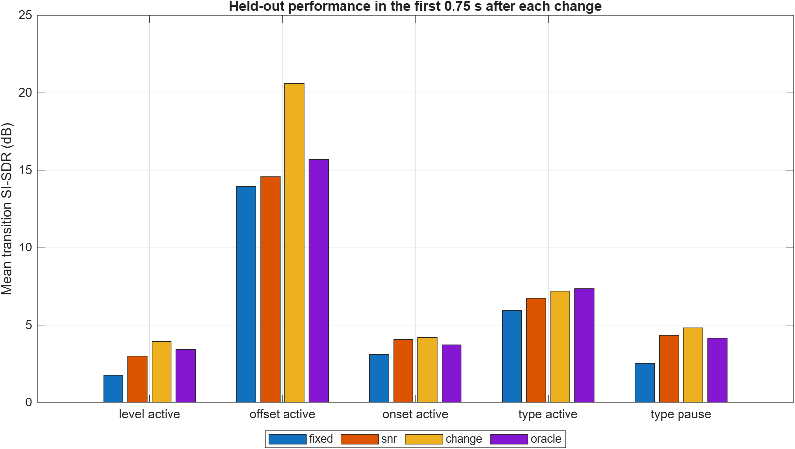
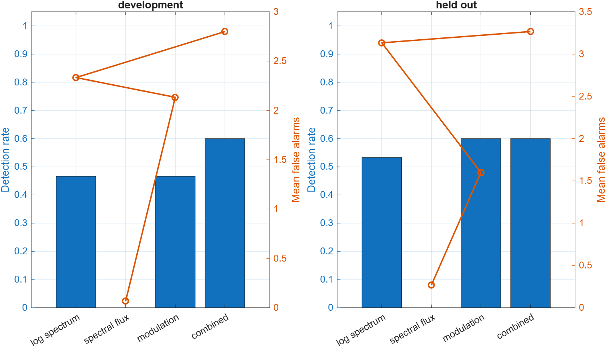
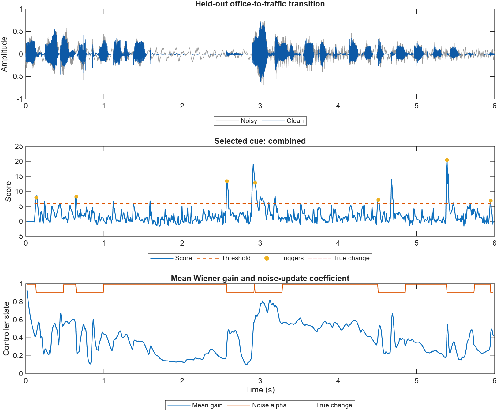

# How Quickly Should a Speech Enhancer Adapt?

## Modulation-Aware Speech Enhancement in Dynamic Acoustic Scenes

**ELEC5305 Audio and Acoustic Signal Processing Project**

**Student:** Liya Xu | **SID:** 530519058 | **GitHub:** [Liyaxuxu](https://github.com/Liyaxuxu)

## Latest: noise-presence guard follow-up

A new frozen follow-up tested whether a causal background-noise occupancy gate could reject speech-only false alarms and whether a milder controller response would improve the complete enhancer. It used 48 development cases for selection and 48 fresh-excerpt confirmation cases that were not used for tuning.

| Confirmation result | Unguarded / fixed reference | Guarded and tuned |
|---|---:|---:|
| Detector hit rate | 0.700 | 0.567 |
| No-change false alarms/min | 46.19 | 28.10 |
| Whole-signal SI-SDR (dB) | 3.401 fixed | 3.481 |
| Transition SI-SDR (dB) | 4.285 fixed | 4.177 |
| STOI | 0.85744 fixed | 0.85750 |

**The simple gate is not accepted as an overall improvement.** It reduced confirmation false alarms by 39.2%, including a reduction on clean speech, but missed four additional scheduled changes. The tuned complete system gained only 0.080 dB whole-signal SI-SDR, lost 0.108 dB transition SI-SDR, and left STOI effectively unchanged. This negative result shows that onset, offset and stationary controls need different directional logic rather than one persistent-noise rule. See the [full follow-up, frozen protocol, condition results and uncertainty analysis](results/noise_guard_study/README.md).

## Previous: false-alarm audit

The previous experiment adds no-change controls, a persistent noise-floor cue, a speech-related threshold, causal startup checks, and frozen validation on unused speech/noise excerpts. It contains 48 development and 48 validation cases. The revised detector is an experimental option; the default controller is preserved.

| Validation result | Original combined | Revised |
|---|---:|---:|
| Detected scheduled changes | 20/30 | 23/30 |
| No-change false alarms/min | 62.38 | 41.90 |
| Matched latency (s) | 0.617 | 0.175 |
| STOI | 0.83446 | 0.83108 |

**The complete enhancer has not improved.** Detection false alarms fell by 32.8% overall, but STOI and whole-signal SI-SDR declined. Clean-speech-only false alarms increased from 65.71 to 98.57/min despite improvements in the office and traffic controls. These failures are retained and discussed in the [full audit, protocol, ablations, uncertainty estimates and reproduction instructions](results/detector_revision/README.md).

The results below are the earlier pilot, retained for provenance. They use different excerpts, initialization and scoring; do not compare their 60% detection rate or false-alarm counts directly with this revision. The old batch initialization was not fully causal at startup. The revision verifies past-only decisions with future-perturbation tests and adds frame-availability time to detection latency.

## Project focus

This project studies the transient behaviour of a causal STFT speech enhancer when the acoustic environment changes abruptly. The main question is:

> Can a lightweight modulation/change-aware controller reduce adaptation delay and speech distortion compared with fixed and SNR-only Wiener baselines?

A second question is whether whole-utterance metrics hide short but important failures immediately after a scene change. The system is deliberately based on interpretable DSP so that its noise estimate, change score, Wiener gain, smoothing state, and adaptation rate can be inspected directly.

## Current progress

| Component | Status | Current evidence |
|---|---|---|
| Topic and research question | Complete | Scope revised around adaptation speed in controlled dynamic scenes. |
| Literature review | Complete for Feedback Two | Classical enhancement, modulation processing, streaming latency, neural reference, and recent adaptation work are synthesised in [`literature_review.md`](literature_review.md). |
| Dataset collection | Complete for preliminary testing | Official VoiceBank clean test speech and DEMAND OOFFICE/STRAFFIC recordings; provenance and split are documented in [`data/`](data/). |
| Controlled SNR mixer | Complete | Unit test verifies requested global SNR. |
| Dynamic scene generator | Complete | Creates a known noise A to noise B transition with pre/post SNR metadata. |
| Fixed spectral subtraction | Complete | Retained as a basic ELEC5305 baseline. |
| Fixed Wiener enhancer | Complete | Uses one common STFT/Wiener pipeline. |
| SNR-adaptive Wiener controller | Preliminary | Changes PSD-update and gain-smoothing rates using estimated frame SNR. |
| Change-aware Wiener controller | Preliminary | Two frozen detector revisions reduce false alarms but do not yet improve the complete system consistently. |
| Oracle change-triggered Wiener | Complete | Uses the known simulated transition time as a diagnostic reference, not a guaranteed quality upper bound. |
| Automated tests | Complete | Mixing, output validity, scene metadata, and all controller modes pass. |
| Real VoiceBank/DEMAND evaluation | Expanded preliminary | Five conditions, three repetitions, separate development/held-out speakers, and non-overlapping noise excerpts. |
| Change-cue ablation | Complete for current data | Log-spectrum, spectral flux, short-time modulation, and combined cues evaluated independently. |
| Transition diagnostics | Complete for current data | STOI, SI-SDR, settling time, steady-state score, speech error, residual-noise suppression, and runtime. |

## Weeks 1--9 checkpoint

| Weeks | Required activity | Evidence in this repository |
|---|---|---|
| 1--2 | Consider project topic | Revised title, focused research question, four-system comparison, and oracle diagnostic. |
| 3--5 | Literature review and dataset collection | [`literature_review.md`](literature_review.md), [`references.bib`](references.bib), dataset provenance, checksums, and [`data/experiment_manifest.csv`](data/experiment_manifest.csv). |
| 6--9 | Initial implementation and testing | Causal STFT/Wiener implementation, controlled transition generator, three real-data conditions, automated tests, CSV results, plots, and listening examples. |

This checkpoint means the scheduled work has been attempted and documented. It does not mean that the final held-out experiment or controller tuning is complete.

## Experimental structure

```text
Clean speech + noise A + noise B + known transition time
                         |
                         v
               Controlled dynamic mixture
                         |
                         v
                   Causal STFT
                         |
            +------------+-------------+
            |            |             |
         Fixed       SNR-only      Change/oracle
       controller    controller      controller
            |            |             |
            +------------+-------------+
                         |
                   Wiener gain
                         |
                         v
                      ISTFT
                         |
                         v
     Global metrics + transition-region diagnostics
```

All four main systems use the same Wiener enhancement equation. Only the controller changes. This makes it possible to separate the effect of change detection from the effect of faster noise tracking and weaker gain smoothing.

## Historical Pilot Results

The expanded study uses VoiceBank speaker `p232` for development and held-out speaker `p257` for testing. Each split contains three speech sequences and non-overlapping DEMAND excerpts. Five conditions are tested: level change, noise-type change, onset, offset, and the same noise-type change during a controlled speech pause. Every change occurs at 3.0 seconds.



| Held-out condition | Fixed | SNR-adaptive | Change-aware | Oracle |
|---|---:|---:|---:|---:|
| Level change | 1.76 | 2.98 | **3.95** | 3.40 |
| Noise offset | 13.95 | 14.58 | **20.61** | 15.68 |
| Noise onset | 3.08 | 4.07 | **4.21** | 3.73 |
| Noise-type change during speech | 5.93 | 6.75 | 7.20 | **7.36** |
| Noise-type change during pause | 2.52 | 4.34 | **4.82** | 4.16 |

Values are mean SI-SDR in the first 0.75 seconds after the change, in dB. Across all held-out conditions, change-aware processing achieved 4.22 dB whole-signal SI-SDR compared with 2.49 dB for fixed Wiener. However, mean STOI was approximately 0.93 for change-aware and 0.92 for fixed, while the unprocessed mixtures were approximately 0.94. The current controller therefore improves distortion-based measures but does not yet demonstrate an intelligibility improvement.

### Detector ablation



The combined cue was selected using development data and then frozen. On the held-out cases it detected 60% of changes within 1.5 seconds, with 0.79 seconds mean latency among detected cases and 3.27 false alarms before each change. The detector is therefore still the main weakness. Spectral flux produced few false alarms but missed all transitions at the current threshold; modulation reduced false alarms relative to the combined cue but was not selected by the predefined development cost.

### Transition diagnostics



The study now saves the Wiener gain and applies it separately to clean speech and added noise. This allows transition speech error and residual-noise suppression to be measured independently. The recovery curve, speech/noise trade-off, complete per-case metrics, and summaries are available in [`results/`](results/). These are still preliminary results: only two speakers and two noise environments are included.

## Compared systems

1. **Fixed Wiener:** fixed noise-tracking and gain-smoothing parameters.
2. **SNR-adaptive Wiener:** adaptation controlled only by estimated frame SNR.
3. **Change-aware Wiener:** adaptation triggered by a spectral/modulation change score.
4. **Oracle Wiener:** adaptation triggered by the known simulated change time.
5. **Fixed spectral subtraction:** retained as a basic baseline, not the main research system.

## Real-data protocol

Clean VoiceBank speech is mixed with selected DEMAND noises to create controlled scene changes. The current checkpoint implements:

- a noise-level change;
- a noise-type change at the same nominal SNR;
- noise onset and noise disappearance;
- the same noise-type transition during active speech and a controlled pause.

Development uses speaker `p232`; held-out evaluation uses speaker `p257` and non-overlapping noise excerpts. Detector selection is performed only on development cases. The exact inputs are listed in [`data/experiment_manifest.csv`](data/experiment_manifest.csv).

The planned metrics are detection latency, false-alarm rate, transition settling time, transition-region SI-SDR or segmental SNR, STOI, residual-noise suppression, speech distortion, and processing time.

## Reproduce the experiments

### Requirements

- MATLAB R2026a or a compatible release
- Signal Processing Toolbox

After downloading the official data described in [`data/README.md`](data/README.md), run the real-data experiment from the repository root:

```matlab
addpath('src');
run('src/run_full_transition_study.m');
```

The dataset-independent smoke test is:

```matlab
addpath('src');
run('src/run_transition_demo.m');
```

Run the automated checks with:

```matlab
addpath('src');
run('tests/run_tests.m');
```

## Repository structure

```text
.
|-- src/
|   |-- generate_dynamic_scene.m   Known-time noise transition generator
|   |-- transition_wiener.m        Four Wiener controller modes
|   |-- scene_change_detector.m    Four independently evaluated change cues
|   |-- apply_stft_gain.m          Speech/noise decomposition analysis
|   |-- run_full_transition_study.m Development and held-out study
|   |-- run_transition_demo.m      Reproducible preliminary experiment
|   |-- run_real_data_experiment.m VoiceBank + DEMAND transition experiment
|   |-- spectral_subtraction.m     Basic fixed baseline
|   `-- add_noise_at_snr.m         Controlled stationary mixture helper
|-- tests/run_tests.m              Automated MATLAB checks
|-- results/                        Figures, metrics, and audio examples
|-- docs/index.md                   GitHub Pages progress report
|-- data/                           Dataset provenance and experiment manifest
|-- literature_review.md            Focused literature review
|-- proposal.pdf                    Submitted proposal
`-- references.bib                  Project bibliography
```

## Next milestones

1. Replace the rejected single occupancy gate with separate onset, offset and stationary-noise states, using development data only.
2. Add more speakers, noise environments, transition pairs, and random seeds.
3. Validate the fixed Wiener implementation against an independent reference.
4. Repeat held-out testing with confidence intervals or statistical tests.
5. Add pretrained DeepFilterNet3 only as an optional modern reference.

## Selected references

1. S. F. Boll, "Suppression of Acoustic Noise in Speech Using Spectral Subtraction," *IEEE Transactions on Acoustics, Speech, and Signal Processing*, 1979. [doi:10.1109/TASSP.1979.1163209](https://doi.org/10.1109/TASSP.1979.1163209)
2. P. Scalart and J. V. Filho, "Speech Enhancement Based on a Priori Signal to Noise Estimation," *ICASSP*, 1996. [doi:10.1109/ICASSP.1996.543199](https://doi.org/10.1109/ICASSP.1996.543199)
3. P. C. Loizou and G. Kim, "Reasons Why Current Speech-Enhancement Algorithms Do Not Improve Speech Intelligibility and Suggested Solutions," *IEEE Transactions on Audio, Speech, and Language Processing*, 2011. [doi:10.1109/TASL.2010.2045180](https://doi.org/10.1109/TASL.2010.2045180)
4. K. K. Paliwal, B. Schwerin, and K. Wojcicki, "Modulation Domain Spectral Subtraction for Speech Enhancement," *Interspeech*, 2009. [doi:10.21437/Interspeech.2009-413](https://doi.org/10.21437/Interspeech.2009-413)
5. C. Valentini-Botinhao, "Noisy Speech Database for Training Speech Enhancement Algorithms and TTS Models," University of Edinburgh DataShare, 2017. [Dataset](https://doi.org/10.7488/ds/2117)
6. C. H. Taal et al., "An Algorithm for Intelligibility Prediction of Time-Frequency Weighted Noisy Speech," *IEEE Transactions on Audio, Speech, and Language Processing*, 2011. [doi:10.1109/TASL.2011.2114881](https://doi.org/10.1109/TASL.2011.2114881)

## Academic integrity and licence

Published methods and datasets are cited in the proposal and bibliography. Third-party dataset files are not committed. The implementation in this repository is distinguished from external reference implementations.

Copyright (c) 2026 **Liya Xu**. Repository code is released under the [MIT License](LICENSE).
