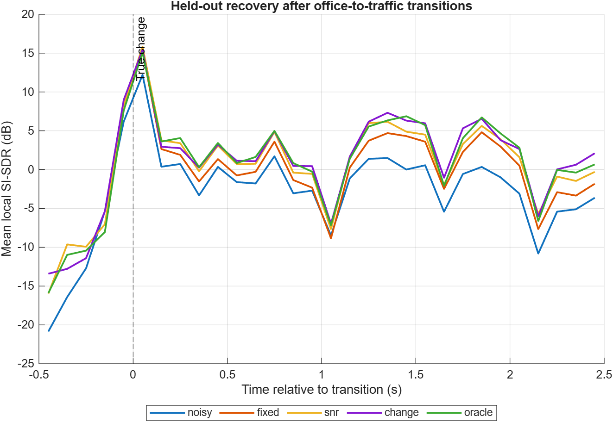
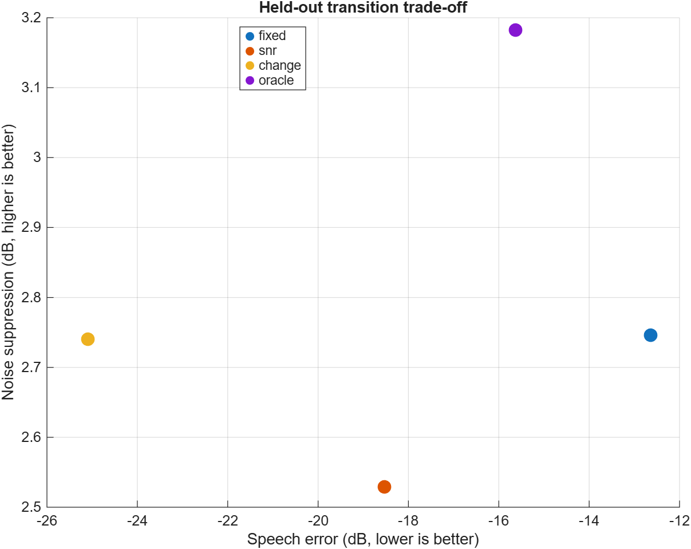

# How Quickly Should a Speech Enhancer Adapt?

## Modulation-Aware Speech Enhancement in Dynamic Acoustic Scenes

**Liya Xu | SID 530519058 | ELEC5305 Project**

[Source code and complete results](https://github.com/Liyaxuxu/elec5305-project-530519058)

[Original proposal (PDF)](https://github.com/Liyaxuxu/elec5305-project-530519058/blob/main/Proposal/Proposal.pdf) | [Updated proposal (PDF)](https://github.com/Liyaxuxu/elec5305-project-530519058/blob/main/Proposal/Proposal%20R%20Updated.pdf) | [Updated LaTeX source](https://github.com/Liyaxuxu/elec5305-project-530519058/blob/main/Proposal/Proposal%20R%20Updated.tex)

## Latest: testing false alarms

The latest study compares the original detector with a persistent noise-floor cue and a speech-related threshold. It uses 48 development cases and 48 new validation cases, including 18 no-change controls in each split. Parameters were selected on development data and frozen before validation.

| Validation metric | Original | Revised |
|---|---:|---:|
| Changes detected within 1.5 seconds | 20/30 | 23/30 |
| False alarms/min on no-change controls | 62.38 | 41.90 |
| Matched detection latency (s) | 0.617 | 0.175 |
| Whole-signal SI-SDR (dB) | 4.507 | 3.612 |
| STOI | 0.83446 | 0.83108 |

False alarms decreased by 32.8% overall, but enhanced speech quality declined. The revised detector remains experimental. It also fails on clean speech alone: false alarms increased from 65.71 to 98.57/min, while office and traffic controls improved. The results do not establish an improved complete enhancer.

The new protocol checks causality at startup, uses one-to-one event matching, and includes duplicate/late alarms. Six sequence clusters, rather than all condition variants, are used for uncertainty estimates. The detection-rate difference is uncertain on this small sample. p257 has appeared in earlier work, so these are unused excerpts from a previously seen speaker.

[Full audit and reproducible code](https://github.com/Liyaxuxu/elec5305-project-530519058/tree/main/results/detector_revision)

## Earlier Pilot

The following material preserves the previous experiment. Its startup estimate reads an initial batch of frames; the latest experiment corrects this with past-only calibration. Its dataset and false-alarm definition differ, so the old and new numbers are not directly comparable. The time-informed oracle is a diagnostic reference, not a guaranteed upper bound on speech quality.

## Research question

Can a lightweight modulation/change-aware controller reduce adaptation delay and speech distortion after an abrupt acoustic change, compared with fixed and SNR-only Wiener baselines?

All systems use the same causal STFT/Wiener enhancement equation. Only the controller changes. The known-time oracle is a diagnostic system that separates change-detection failure from controller failure.

## Experiment completed

Clean VoiceBank speech is mixed with DEMAND OOFFICE and STRAFFIC recordings. Speaker `p232` is used for development and `p257` is held out. Three speech sequences and non-overlapping noise excerpts are used in each split.

Five controlled conditions occur at 3.0 seconds:

1. Office noise changes from 10 dB to 0 dB SNR.
2. Office noise changes to traffic noise during active speech.
3. Traffic noise begins during active speech.
4. Traffic noise disappears during active speech.
5. Office noise changes to traffic noise during a controlled speech pause.

Four controllers are compared: fixed, SNR-adaptive, change-aware, and oracle-triggered Wiener. The same mixtures are also used to compare log-spectrum difference, spectral flux, short-time modulation, and a combined change cue.

## Held-out enhancement results

Mean SI-SDR in the first 0.75 seconds after each change:

| Condition | Fixed | SNR-adaptive | Change-aware | Oracle |
|---|---:|---:|---:|---:|
| Level change | 1.76 | 2.98 | **3.95** | 3.40 |
| Noise offset | 13.95 | 14.58 | **20.61** | 15.68 |
| Noise onset | 3.08 | 4.07 | **4.21** | 3.73 |
| Type change during speech | 5.93 | 6.75 | 7.20 | **7.36** |
| Type change during pause | 2.52 | 4.34 | **4.82** | 4.16 |

Across the five held-out conditions, change-aware processing obtained 4.22 dB mean whole-signal SI-SDR, compared with 2.49 dB for fixed Wiener. Mean STOI was approximately 0.93 for change-aware and 0.92 for fixed, while the unprocessed mixtures were approximately 0.94. The SI-SDR improvement therefore does not yet establish an intelligibility improvement.

## Detector result

The combined cue was selected using development data and frozen before held-out evaluation. It detected 60% of held-out changes within 1.5 seconds. Detected cases had 0.79 seconds mean latency, and there were 3.27 false alarms before each true transition.

This is the current limitation. Spectral flux rarely produced a false alarm but missed all changes at the current threshold. The modulation cue reduced false alarms but did not outperform the combined cue under the development selection rule.

## Transition analysis

The figure shows a held-out office-to-traffic example, including the true transition, detected triggers, mean Wiener gain, and noise-estimator update coefficient. It demonstrates why detector accuracy and controller behaviour must be reported separately.

The recovery curve aligns held-out office-to-traffic cases at the known change time and reports local SI-SDR every 100 ms.

The saved Wiener gain is also applied separately to clean speech and added noise. This measures the central trade-off directly: reducing residual noise versus introducing speech distortion.

## Interpretation

The change-aware controller improves SI-SDR in the current held-out experiment, particularly for level changes and noise offset. However, the detector remains unreliable and STOI does not show the same improvement. The project therefore does not claim that the proposed controller is universally better.

The next priority is to improve detection using development data only, then repeat held-out evaluation with more speakers, noise environments, transition pairs, and random seeds. DeepFilterNet3 remains an optional modern reference after the DSP analysis is stable.

## Reproducibility

The repository provides the dataset manifest, source code, per-case CSV files, summary tables, automated tests, figures, and audio examples. Raw third-party datasets are not committed.

[Full README](https://github.com/Liyaxuxu/elec5305-project-530519058#readme) | [Literature review](https://github.com/Liyaxuxu/elec5305-project-530519058/blob/main/literature_review.md) | [Dataset provenance](https://github.com/Liyaxuxu/elec5305-project-530519058/tree/main/data)
