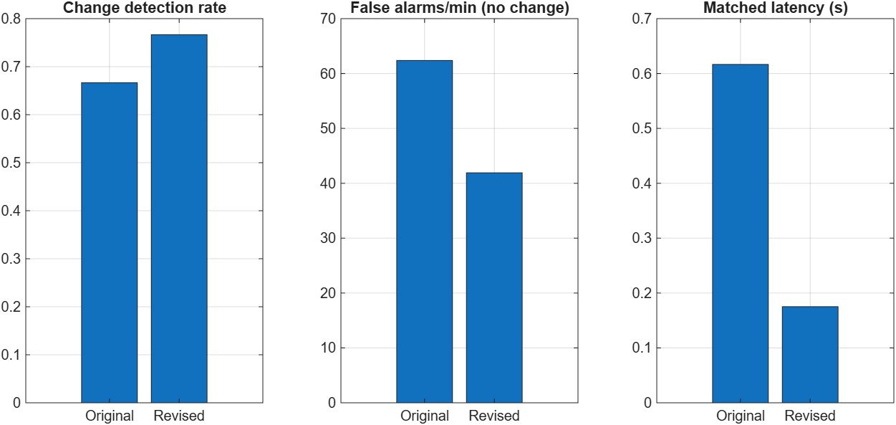
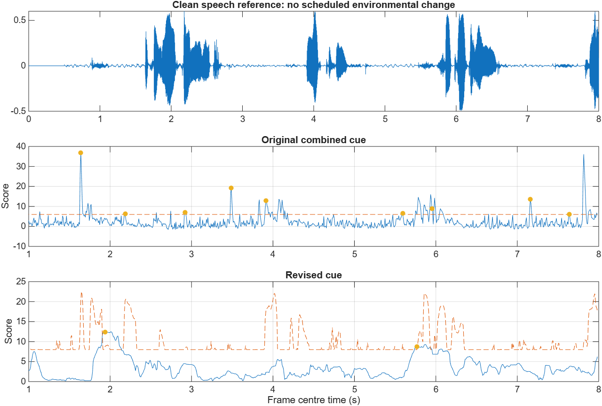

# Detector Revision: Frozen Validation

This experiment tests whether persistent noise-floor changes and a speech-related threshold can reduce false alarms. It preserves the original combined detector as a baseline. The revised detector is an experimental option, not a replacement for the default enhancer.

## Result

| New validation excerpts | Original combined | Revised |
|---|---:|---:|
| Matched transitions within 1.5 s | 20/30 (66.7%) | 23/30 (76.7%) |
| False alarms/min, all no-change controls | 62.38 | 41.90 |
| Matched detection latency (s) | 0.617 | 0.175 |
| Latency with misses assigned 1.5 s | 0.911 | 0.484 |
| Whole-signal SI-SDR, same 48 cases (dB) | 4.507 | 3.612 |
| STOI, same 48 cases | 0.83446 | 0.83108 |

False alarms fell by 32.8% on the combined controls, but enhanced speech quality did not improve. This is a detector improvement on this sample, not evidence of an improved complete speech enhancer. The unchanged fast-update controller may respond differently to the new trigger pattern; this explanation still requires a controller ablation.

The average hides a serious failure. For stationary office noise, false alarms fell from 65.71 to 27.14/min; for stationary traffic, from 55.71 to 0/min. **For clean speech without added noise, they increased from 65.71 to 98.57/min.** The temporal lower quantile still follows speech pauses and syllables when there is no sustained noise floor. That behavior prevents a general robustness claim.



## What changed

The original detector takes the maximum of three normalized spectral/modulation scores. A large change in any one cue can trigger it. The candidate detector instead compares temporal lower quantiles of eight positive-frequency subbands: the latest 0.20 s against the preceding 0.65 s. Its score is the median absolute band change in dB. Short speech peaks have less influence on this noise-floor proxy.

A separate heuristic measures how far current broadband energy rises above the recent floor. When this excess exceeds 6 dB, it raises the trigger threshold. This is a **speech proxy**, not a validated voice-activity detector, phoneme classifier, or proof that a change was caused by speech.

Development selected the floor cue, an 8 dB threshold, four consecutive exceeding frames (32 ms at the 8 ms hop), a speech weight of 0.75, and a 350 ms refractory period. A same-parameter ablation without the speech-related threshold gives 46.19 false alarms/min on validation controls, compared with 41.90 with it; both match 23/30 transitions. The full reduction versus the original combines the floor cue, threshold and persistence changes, not just the speech gate.

This floor cue is a lightweight temporal alternative to the earlier modulation proxy; it should not be described as a new modulation-spectrum algorithm.

## Protocol and leakage checks

- Development: six disjoint sequences from speaker p232, using sorted source-file positions 30--77; six 8-second noise excerpts starting at 70, 78, 86, 94, 102 and 110 seconds.
- Validation: six new sequences from p257, using positions 90--137; noise excerpts starting at 200, 208, 216, 224, 232 and 240 seconds. Exact filenames and seeds are in the manifests. p257 was used in an earlier pilot, so this is new-excerpt validation on a previously seen speaker, not a newly unseen-speaker claim.
- Each sequence produces five change cases and three no-change controls: level, type, onset, offset, type during a pause; office unchanged, traffic unchanged, and clean speech. There are 48 cases per split, with 30 scheduled changes and 18 controls.
- A seeded choice places the transition between 2.5 and 4.5 seconds in an active reference-speech region. The clean reference is used only to construct and score mixtures, never by either detector.
- Each sequence uses eight consecutive source files, concatenated in order and cropped to 7.5 seconds after a 0.5-second noise-only calibration prefix. Source lists may include files beyond the crop; no speech is repeated or padded to force the duration.
- The pause case fades the speech down over 20 ms around a 0.5-second pause. It retains exactly the same added noise as the active type-change case; speech removal does not rescale noise or create a second noise-level manipulation.
- All systems in this experiment use a causal calibration prefix. The legacy enhancer's default initial estimate uses its first 250 ms in a batch, so the older results must not be described as a verified fully causal stream. The revised option accumulates only frames already available during calibration.
- Analysis uses a 32 ms centered STFT with an 8 ms hop. Detection times are frame-centre times plus 16 ms, when that frame becomes available. Complete microphone input/output latency is not measured.
- Both detectors are scored from 1 to 8 seconds. One alarm can match a transition in its next 1.5 s; every other alarm, including duplicate and late alarms, is false relative to the scheduled labels. The reported rate divides false alarms by total monitored time. An unmatched event has undefined matched latency and a 1.5 s penalty in the selection objective.
- Natural DEMAND fluctuations can trigger a detector even when no transition was scheduled. Thus these labels measure response to the controlled transition, not a human annotation of every audible acoustic event.

## Development selection

The search tested 48 combinations: two score families, thresholds 4/6/8/10, persistence 2/4/8 frames, and speech weights 0/0.75. Candidate hit rate had to be no more than five percentage points below the original development detector. Among eligible candidates the cost was:

```text
false alarms/min + 3 * penalised latency + 20 * miss rate
```

The entire grid is retained in `development_search.csv`. Configuration was written to `frozen_config.json` before validation was run. No parameter was changed after validation. The validation results include unsuccessful conditions and quality regressions.

Frozen SHA-256 hashes:

```text
robust_change_features.m  30DC95BA0FBADAE95F3AE75ACCBF21B128F6784BB774F9D9386D5C99CE9291F9
trigger_change_features.m AC8EE729E9A7EE96F9FF893FC52875140E19DB0FD73CC00D0CD4F84606DEF9F4
frozen_config.json        0C0221D8215AB84792F4AE362679D4FA394585BB0B11AA937C3E62D1AB097468
```

## False-alarm audit

Each false trigger is saved with its timestamp, reference speech-activity flag, and distance to a reference speech onset. The activity label uses a 20 ms reference-energy envelope and a 2% peak-energy threshold; it is only an offline diagnostic label. On validation, 67.2% of original false alarms and 44.2% of revised false alarms fall within 100 ms of such an onset. This is an association, not a causal attribution, since the duration occupied by onset neighborhoods is not controlled and no phoneme labels are available.



## Uncertainty and limitations

The bootstrap resamples the six underlying sequences together with all their conditions, rather than pretending all 48 variants are independent. With 5,000 paired resamples, the validation difference in no-change false alarms/min is -20.48 with a descriptive 95% interval [-28.57, -11.90]. The detection-rate difference is +0.10 with interval [-0.23, +0.47], so the sample does not establish a detection-rate improvement. The STOI difference is -0.00338 with interval [-0.00522, -0.00183]. See `paired_uncertainty.csv`.

These intervals describe only six sequences from one validation speaker and two environmental recordings. They do not establish population-level generalization. Frequent alarms can also accidentally match an event within the generous 1.5-second window, which is why no-change controls are essential.

The same saved Wiener gain is applied to clean speech and noise and their sum is checked against the actual output. Exact reconstruction makes SI-SDR infinite; those cases are recorded as `NaN` rather than a misleading huge finite number. Consequently the noisy-reference mean can have a different valid count; compare paired finite cases, not rankings across all summary means. `evaluation_runtime_s` excludes cached detector extraction and includes diagnostic reconstruction, so it is not an end-to-end runtime benchmark.

## Reproduce

From the repository root in MATLAB (Signal Processing, Audio, and Statistics and Machine Learning Toolboxes):

```matlab
addpath('src');
run_detector_revision('develop');            % selection on p232 only
run_detector_revision('validate');           % reads frozen_config.json
summarise_detector_revision;
addpath('tests');
test_detector_revision;
```

To audit the development set without repeating selection, use `run_detector_revision('audit_development')`. The tests check future-sample invariance, startup causality, one-to-one event matching, and exact gain decomposition. CSVs, plots and configuration are committed; raw audio and temporary MAT state remain local.

Next work should target the noise-free speech failure on development data and separately investigate the fast-update controller. A further tuned version will require a fresh confirmatory split; this validation set has now been observed.
