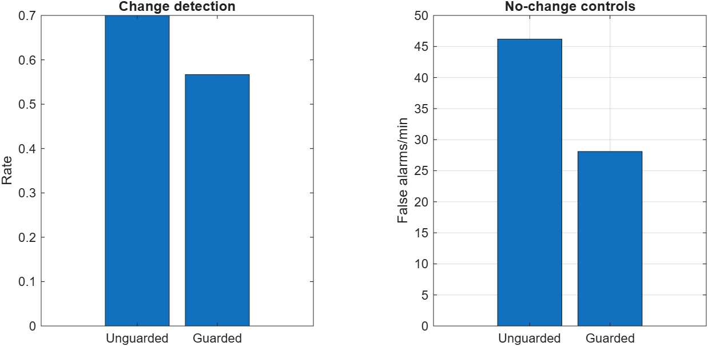
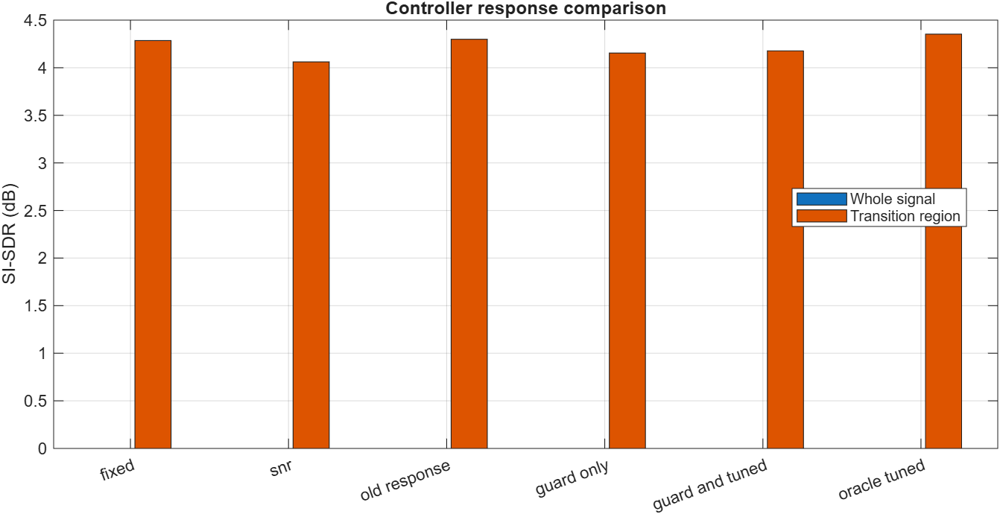

# Noise-Presence Guard and Controller Follow-up

## Question

The preceding detector revision reduced false alarms in stationary office and traffic noise, but it fired more often on clean speech. This follow-up asks two narrower questions:

1. Can a causal estimate of persistent background-noise occupancy reject speech-only false alarms without hiding real acoustic changes?
2. Can a milder fast-update response convert better detector behaviour into better enhanced speech?

This is a follow-up experiment, not a replacement for the earlier audit. Unsuccessful conditions are retained.

## Method

The detector now compares the lower temporal spectral envelope with the local 80th-percentile signal level. A trigger is allowed only when this noise-occupancy estimate exceeds a threshold. No clean reference, future frame, or true transition label is used at runtime.

The development search varied only the occupancy threshold while retaining the previously frozen floor cue, 8 dB change threshold, four-frame persistence and speech-related threshold. The guard had to preserve all 29 changes detected by the unguarded development detector. The controller search then varied its fast noise-update rate, gain smoothing and hold duration. Candidates had to preserve fixed-Wiener whole-signal SI-SDR and remain within 0.001 STOI before transition SI-SDR was considered.

Development uses six p232 sequences and DEMAND excerpts from 70--118 seconds. The frozen confirmation uses p257 utterances at positions 200--247 and DEMAND excerpts from 130--178 seconds. Speech files and noise intervals do not overlap. The confirmation speaker is not new to the repository, so this is fresh-excerpt confirmation, not unseen-speaker validation.

## Frozen configuration

- Noise-occupancy threshold: -9 dB
- Fast noise update coefficient: 0.985
- Fast gain-smoothing coefficient: 0.70
- Hold time: 0.35 seconds

These values are stored in `frozen_config.json`. They were selected on development data before the confirmation phase was run.

## Detector results

| Split | Detector | Hit rate | Penalised latency (s) | No-change false alarms/min |
|---|---|---:|---:|---:|
| Development | Unguarded | 0.967 | 0.262 | 48.57 |
| Development | Noise guarded | 0.967 | 0.260 | 30.95 |
| Confirmation | Unguarded | 0.700 | 0.660 | 46.19 |
| Confirmation | Noise guarded | 0.567 | 0.835 | 28.10 |

The guard cuts confirmation false alarms by 39.2%, but it also misses four additional scheduled changes. On clean-speech controls, false alarms fall from 108.57 to 57.14 per minute. The same rule harms noise offset and onset detection because a disappearing or newly emerging noise floor does not always satisfy a persistent-noise gate at the decision frame.

## Enhancement results

| Confirmation system | Whole SI-SDR (dB) | STOI | Transition SI-SDR (dB) |
|---|---:|---:|---:|
| Fixed Wiener | 3.401 | 0.85744 | 4.285 |
| SNR adaptive | 3.348 | 0.85647 | 4.061 |
| Old detector and response | 3.633 | 0.85747 | 4.299 |
| Noise guard, old response | 3.591 | 0.85663 | 4.154 |
| Noise guard, tuned response | 3.481 | 0.85750 | 4.177 |
| Oracle, tuned response | 3.438 | 0.85745 | 4.352 |

The tuned guarded system improves whole-signal SI-SDR by 0.080 dB over fixed Wiener and leaves mean STOI essentially unchanged, but transition SI-SDR decreases by 0.108 dB. It therefore does not establish an improved complete enhancer. The original response performs better on this confirmation sample, although it still has frequent detector false alarms.

A paired bootstrap resampling the six source sequences gives descriptive 95% intervals of [-22.14, -14.29] false alarms/min for the guard-minus-unguarded comparison and [-0.217, -0.004] dB for guarded-and-tuned minus fixed transition SI-SDR. The whole-signal SI-SDR interval is [0.016, 0.142] dB, while the STOI interval crosses zero. With one confirmation speaker and two noise recordings, these intervals describe this sample rather than population-level generalisation.





## Interpretation

The experiment rejects the simple idea that a single continuous-noise gate can solve speech-driven false alarms. It distinguishes stationary background noise from clean speech reasonably well, but acoustic changes include onset and disappearance, where requiring persistent noise is structurally inappropriate. A future detector should use separate states or directional rules: evidence from the preceding floor for noise offset, evidence from the new floor for onset, and an occupancy guard for stationary speech-only controls.

The controller result also shows that making the response milder is not automatically beneficial. Detector design and post-trigger adaptation must be evaluated separately. The confirmation data have now been observed and must not be used for further parameter tuning.

## Reproduction

```matlab
addpath('src');
run_noise_guard_study("develop");
run_noise_guard_study("confirm");
summarise_noise_guard_study;
```

The CSV files contain the complete detector search, controller search, per-case outputs, condition summaries and paired sequence-cluster uncertainty estimates. Raw third-party audio remains excluded from Git.
